# Cartografische audit exports — 17 juli 2026

## Scope en werkwijze

Deze audit omvat alle zeven SVG-exports in `exports/`: Bremerhaven, Erfurt, Ghent, Nièvre, Oulu, Paris en Tilburg. De losse Illustrator-referentie van Tilburg is als vergelijkingsbeeld meegenomen. De aangeleverde USE-IT Ghent-publicatie uit 2021 is omgezet naar acht JPG-pagina's in [`references/2021_ghent`](../../references/2021_ghent/).

Elke kaart is:

1. volledig en in overlappende detailtegels bekeken;
2. opnieuw gerenderd met de interne achtergrond fel magenta (`#ff00ff`);
3. met een opvallende fallback-overlay bekeken;
4. structureel onderzocht op lagen, fallbackcategorieën, labels en dubbele SVG-ID's;
5. visueel vergeleken met de huidige standaardweergave van OpenStreetMap voor hetzelfde kader.

De OSM-vergelijking is geen eis dat MapExport dezelfde stijl moet volgen. Zij is gebruikt om onderscheid te maken tussen brongeometrie, generalisatiekeuzes en echte renderer-/classificatiefouten.

## Samenvatting

### Goed nieuws

- **Geen enkele export heeft een dekkingsgat.** Bij alle zeven kaarten bleef binnen het volledige kader exact nul magenta zichtbaar. De v2-coverage promise werkt dus voor deze set.
- Wegen, waterlopen en de hoofdvormen van parken sluiten in het algemeen plausibel aan op OSM.
- De grote crèmekleurige city-blockvlakken zijn een bewuste, passende vereenvoudiging van het stadsweefsel en gelden niet als afwijking. Alleen crèmekleurige vlakken die aantoonbaar een andere semantische categorie hebben, worden hieronder als probleem genoemd.
- Tilburg is visueel de schoonste export en komt inhoudelijk vrijwel exact overeen met de bestaande Illustrator-referentie.

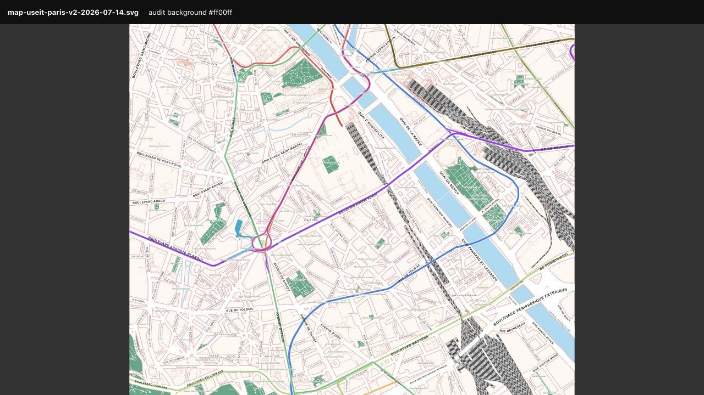

### Prioriteiten

| Prioriteit | Probleem | Steden | Aanbevolen richting |
|---|---|---|---|
| Kritiek | Ondergrondse metro en serviceverbindingen liggen als felle bovengrondse lijnen over de hele kaart | Paris | Tunnelbeleid voor de publiekskaart wijzigen; service-/depotverbindingen filteren; eventueel metro standaard uit en als optionele editorlaag behouden |
| Hoog | Documentbreed niet-unieke SVG-ID's | Vooral Ghent; ook Bremerhaven, Erfurt, Oulu en Paris | Eén documentbrede UID-generator plus laagprefixen; featurelabels nooit uitsluitend op naam identificeren |
| Hoog | Plaats- en gehuchtnamen ontbreken volledig | Nièvre | Zichtbare `place=*`-labellaag toevoegen, met schaal- en collisionregels |
| Hoog | Spooremplacementen worden bijna zwarte moirémassa's | Oulu en Paris; lichter in andere steden | Sporen op exportschaal generaliseren; service tracks onderdrukken of bundelen; casing/sleepers lichter maken |
| Hoog | Semantisch duidelijke vlakken eindigen in fallback/Uncategorized | Bremerhaven, Oulu, Ghent, Nièvre, Tilburg | Bestaande tags aan expliciete rendercategorieën binden; fallback alleen voor echte restvlakken gebruiken |
| Hoog | Pleinen worden als parkfeature én als straat gelabeld | Bremerhaven en Erfurt; mogelijk breder | Eigen Squares/Plazas-laag; één label per plein; uitsluiten van dubbele street-labelpass |
| Middel | Duplicatie en botsing van water-, park- en straatlabels | Ghent, Paris, Bremerhaven, Erfurt, Oulu | Namen per verbonden feature/geografische cluster dedupliceren; collisionmeting baseren op uiteindelijke getransformeerde tekstvorm |
| Middel | Park-, begraafplaats- en spoorpaden zijn te gedetailleerd | Oulu, Bremerhaven, Ghent | Detail op printschaal reduceren; voetpaden dunner/subtieler; minder interne technische geometrie |

### Meetoverzicht

| Stad | Fallbackvlakken | Bekende fallbackcategorieën | Dubbele ID-namen | Extra ID-occurrences | Magenta gaten |
|---|---:|---|---:|---:|---:|
| Bremerhaven | 34 | allotments, golf, industrial, parking, railway, residential, scrub | 2 | 4 | 0 |
| Erfurt | 1 | — | 6 | 6 | 0 |
| Ghent | 25 | scrub | 205 | 230 | 0 |
| Nièvre | 7 | scrub | 0 | 0 | 0 |
| Oulu | 53 | dog park, institutional, parking, residential, scrub, sports centre, wetland | 2 | 4 | 0 |
| Paris | 0 | — | 7 | 7 | 0 |
| Tilburg | 21 | greenery, parking, railway, scrub | 0 | 0 | 0 |

“Dubbele ID-namen” telt verschillende `id`-waarden die meer dan eenmaal voorkomen; “extra ID-occurrences” telt alle voorkomens boven het eerste. Een fallbackcategorie is bekend wanneer de label-only sweep er wel een OSM-tag aan kon koppelen; de resterende patches zijn letterlijk `Uncategorized`.

## Algemene root causes

### 1. Fallback is geometrisch correct, maar semantisch te breed

`fallback_blocks` is volgens het v2-contract een bewuste, auditeerbare deklaag. Dat verklaart waarom er geen gaten zijn. De classificatie van een fallbackpatch gebeurt echter via één representatief punt en de eerste passende label-only polygon. Daardoor kunnen gedeeltelijk bedekte of smalle restvlakken `Uncategorized` blijven, ook als een bekende feature vlak ernaast of gedeeltelijk erover ligt.

Daarnaast worden meerdere bekende tags wel opgehaald maar niet geschilderd: `natural=scrub`, `wetland`, `leisure=dog_park`, `sports_centre`, golfbanen en naamloze allotments. Zij zijn dus niet werkelijk onbekend; er ontbreekt een binding naar Parks & green, Countryside/Landcover of een eigen redactionele laag.

Industrie, spoorgrond en parkeerterreinen vragen om een expliciete keuze. Ze horen niet automatisch groen te worden, maar ook niet blijvend onder `Uncategorized`. Een laag als **Working land / Industrial**, **Railway grounds** en **Paved areas** is voor editors duidelijker.

### 2. ID-uniciteit geldt nu alleen lokaal

Wegen, tram en metrolijnen starten afzonderlijke UID-generators. Gelijknamige objecten in verschillende lagen kunnen daardoor exact dezelfde `id` krijgen. Featurelabels gebruiken bovendien direct `feat_${safeName(name)}` zonder UID-generator. In Ghent levert dit 205 verschillende dubbele IDs en 230 extra ID-occurrences op; voorbeelden zijn `feat_Nederschelde` ×8 en meerdere weg-/tramcombinaties.

Dit is niet alleen een nette-codekwestie: Illustrator, Inkscape, DOM-selectors en latere automatisering kunnen het verkeerde element selecteren. De ID-namespace moet documentbreed uniek zijn.

### 3. Labels worden per OSM-element gemaakt, niet per cartografische feature

Water- en parklabels worden voor ieder OSM-element apart geplaatst. Gesplitste ways met dezelfde naam leveren dus meerdere labels én identieke IDs op. Een collision grid voorkomt slechts een deel van de letterlijke overlap; het dedupliceert niet op naam, verbonden geometrie of geografische afstand.

Pleinpolygonen worden daarnaast synthetisch als `leisure=park` aan de featurelabels toegevoegd en kunnen daarna nogmaals door de street-labelpass worden gelabeld. Dit verklaart de dubbele Domplatz/Peterstraße/Willy-Brandt-Platz-labels en hun verkeerde plek in `water_labels`.

### 4. Rails en metro zijn niet gegeneraliseerd voor de kaartschaal

Elke afzonderlijke rail-way krijgt casing, witte sleepers en een donkere track. In emplacementen stapelen tientallen parallelle OSM-ways zich op tot een bijna zwarte textuur. De geometrie is meestal niet fout; de cartografische generalisatie ontbreekt.

De v2-engine filtert tunnels voor gewone rail en tram, maar laat metro-tunnels bewust door als schematische overlay. In Paris betekent dat dat ondergrondse lijnen, werkplaatsverbindingen en relation/member-wayduplicaten boven straten, parken, Seine en spoor zichtbaar blijven. Als losse editorlaag is dat bruikbaar; als standaard publiekskaart is het misleidend en veel te dominant.

## Stad voor stad

### Bremerhaven

**Hoog — Golfclub Bremerhaven Bürgerpark is een grote crèmekleurige fallback.** De OSM-feature is `leisure=golf_course`, maar golf is alleen label-only en heeft geen schilderregel. De kaart krijgt daardoor een grote crèmekleurige hap in/naast het groene Bürgerpark. Dit hoort cartografisch bij groen/recreatie, eventueel met een eigen subtiele golfcategorie.

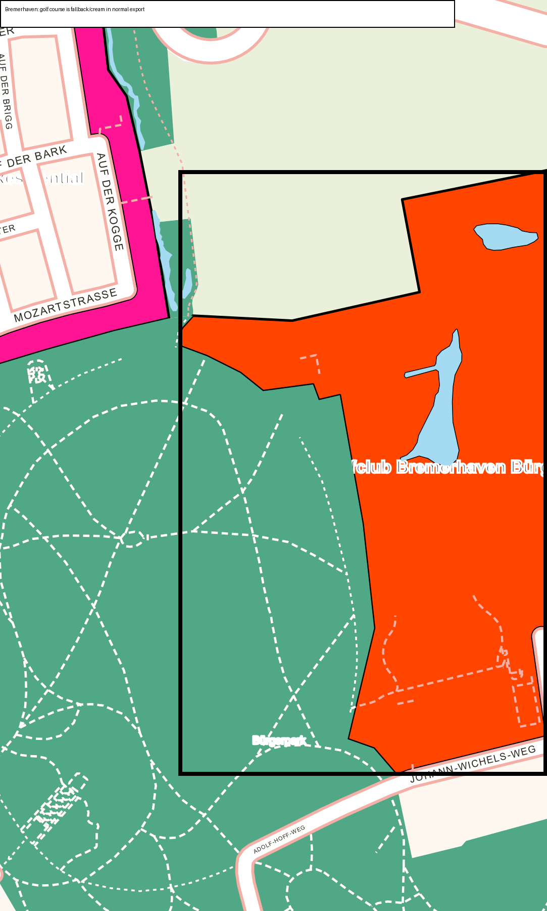

**Hoog — pleinen zijn verkeerd gelayerd en dubbel gelabeld.** Willy-Brandt-Platz en voetgangersdelen van onder meer Bürgermeister-Smidt-Straße worden als groen featurelabel in `water_labels` gezet en ook als straat gelabeld. Maak één Squares/Plazas-groep en één labelbeslissing.

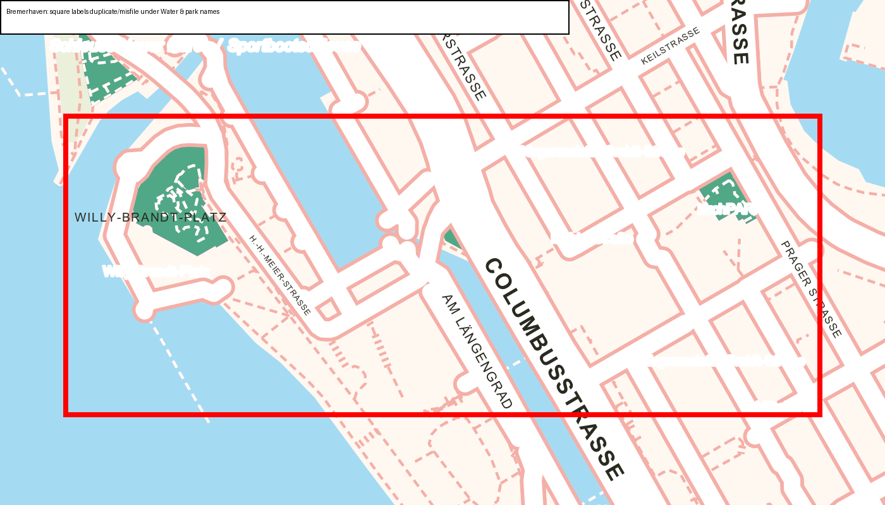

**Middel — 34 fallbackvlakken:** 15 werkelijk Uncategorized, 7 Industrial, 3 Parking, 2 Allotments, 2 Railway grounds, 2 Residential, 2 Scrub en 1 Golf course. Aanbevolen thuis:

- Golf, allotments en scrub → Parks & green / Countryside;
- residential-restvlakken → City blocks na controle van de coverage-drempel;
- industrial, railway en parking → eigen expliciete editorcategorie, niet groen;
- kleine kruising-/haven-/rand-slivers → geometrisch opruimen of herkenbaar als technical remainder labelen.

**Middel — labeldruk en parkpaden.** Geeste verschijnt viermaal; sommige straatnamen botsen of worden aan de kadergrens afgesneden. In Bürgerpark/allotments ontstaat door gelijkwaardig getekende voetpaden een wit raster dat de parkvorm verdringt.

**Structuur:** `feat_Geeste` komt viermaal voor en `feat_B_rgermeister-Smidt-Stra_e` tweemaal. Geen dekkingsgaten.

[Volledige magentatest](screenshots/bremerhaven-magenta-overview.png) · [fallbackoverzicht](screenshots/bremerhaven-fallback-overview.png) · [OSM-vergelijking](screenshots/bremerhaven-osm-comparison.png)

### Erfurt

**Hoog — pleinen dubbel en in de verkeerde laag.** Domplatz, Peterstraße, Markthof en Bahnhofstraße verschijnen als synthetisch park-/featurelabel én als straatlabel. Hospitalplatz is een verdedigbaar geval van park plus gelijknamige straat, maar geeft visueel hetzelfde dubbele naambeeld.

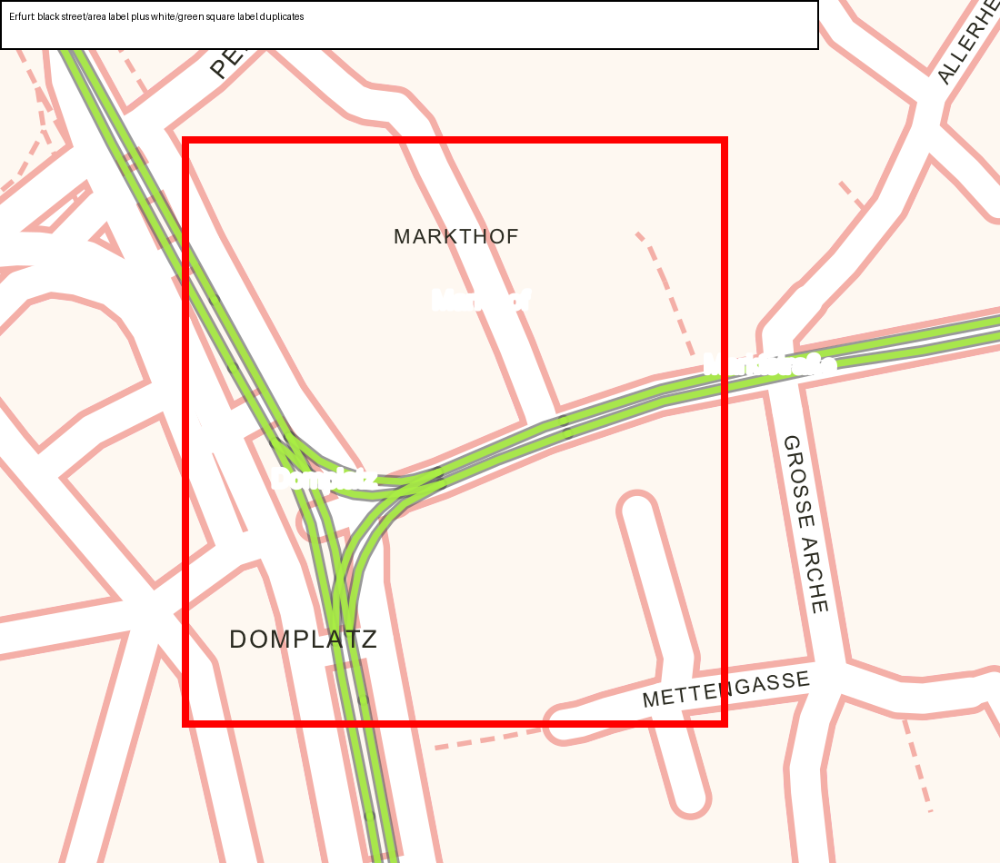

**Hoog — waterlabel Bergstrom (Gera) staat tweemaal vrijwel boven op elkaar.** Losse OSM-waysegmenten worden afzonderlijk gelabeld; er is geen merge/deduplicatie. Breitstrom (Gera) heeft hetzelfde ID tweemaal, al liggen de labels daar verder uit elkaar.

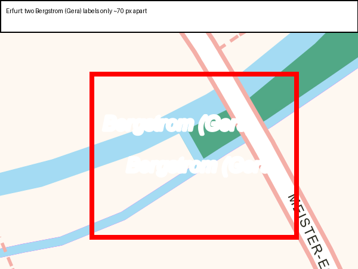

**Middel — tram is te dominant en botst structureel met wegen.** Regierungsstraße heeft dubbele weg-/tram-IDs doordat beide lagen hun eigen UID-generator gebruiken. De neon tramgeometrie vormt rond Anger/Domplatz een spaghetti van overlappende tracks. De groepen `tram_casing` en `tram_fill` missen bovendien een duidelijke `inkscape:label`.

**Laag/middel — één kleine fallback.** Het enige Uncategorized-vlak is een driehoekige pocket in een kruising nabij Domplatz. Omdat de lineaire weg geen label-only area is, krijgt het restvlak geen categorie. Conceptueel hoort dit bij road/junction infill.

[Volledige magentatest](screenshots/erfurt-magenta-overview.png) · [fallbackdetail](screenshots/erfurt-fallback-detail.png) · [OSM-vergelijking](screenshots/erfurt-osm-comparison.png)

### Ghent

**Hoog — zeer veel ongeldige dubbele SVG-ID's.** 205 ID-namen zijn niet uniek, samen 230 extra occurrences. Dit komt zowel door featurelabelnamen als door weg-/tram-ID's. Voor editorbetrouwbaarheid is dit de grootste structurele fout in deze export.

**Hoog/middel — water- en parknamen zijn sterk overgedupliceerd.** In `water_labels` staan 117 teksten maar slechts 78 unieke namen: Nederschelde ×8, Leie ×6, Lieve ×5, Muinkschelde ×5, Achtervisserij ×5, Visserijvaart ×4 en Robert Hoozeepark ×3. De reference uit 2021 is hier aantoonbaar rustiger.

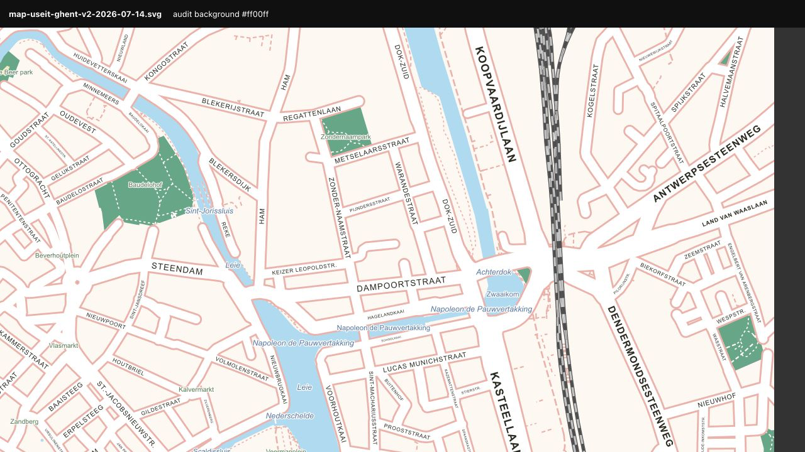

**Hoog — twee scrubvlakken staan crèmekleurig in fallback.** `natural=scrub` wordt opgehaald en de landcoverrenderer kan scrub tekenen, maar de tag ontbreekt in de area-binding. Het grootste stuk ligt bij Dok-Zuid/Koopvaardijlaan. Dit is een concrete classifierbinding die gerepareerd kan worden.

**Middel — 25 fallbackvlakken:** 2 Scrub en 23 Uncategorized. Het grootste echte onbekende vlak ligt bij Sint-Pietersabdij en lijkt een ongetagd terrein/binnenplaats; de meeste andere zijn zeer kleine kade-, park- of topologieslivers.

**Middel — Citadelpark is te druk.** Dichte, even zwaar getekende interne paden en driemaal Robert Hoozeepark maken de kaart daar onrustiger dan de 2021-reference.

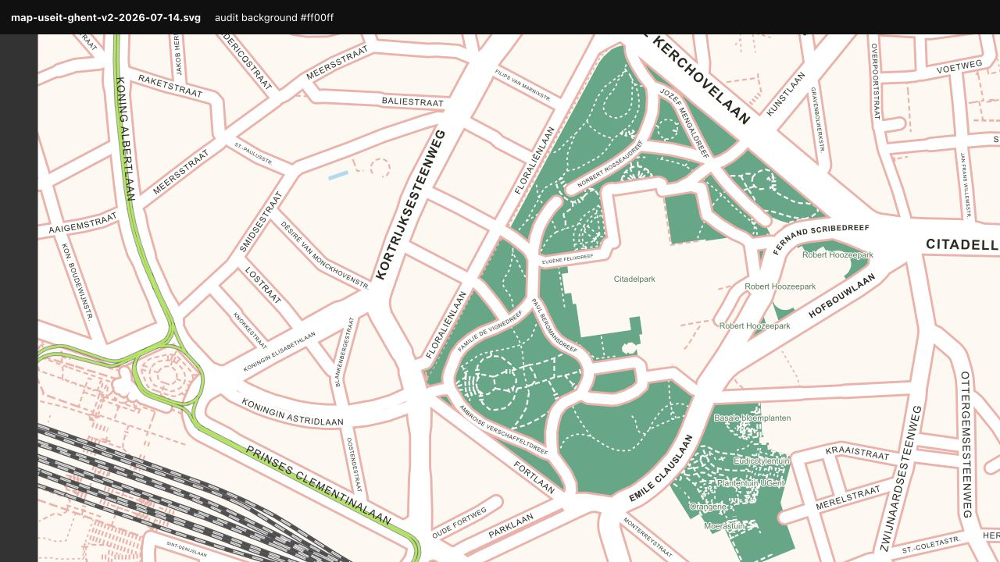

**Laagstructuur:** tramgroepen missen `inkscape:label`; city blocks en losse gebouwen staan plat in één groep. Geen dekkingsgaten.

[Volledige magentatest](screenshots/ghent-magenta-overview.png) · [fallbackoverzicht](screenshots/ghent-fallback-overview.png) · [OSM-vergelijking](screenshots/ghent-osm-comparison.png)

### Nièvre

**Hoog — alle relevante plaatsnamen ontbreken.** De export haalt 67 place nodes op (9 hamlets, 6 isolated dwellings, 52 localities) en bouwt 60 benoemde hamletblobs voor 30 namen, maar geen enkele naam wordt zichtbaar getekend. Namen zoals Montgaudon, La Neuvelle, Les Jardis, Franvache en Villars staan alleen als metadata in `inkscape:label`. Voor een landelijke kaart is dit fataal voor oriëntatie.

**Hoog — een enorm echt OSM-brongat.** `fallback_5` beslaat circa 2,09% van het volledige kader. Het is een ongetagde inner way in een CORINE-meadowrelation, omsloten door Route d'Onlay. De exporter doet contractueel het juiste door het als fallback te tonen, maar de grote crèmekleurige massa is cartografisch zeer opvallend. Dit vraagt primair een OSM-datacorrectie of een bewuste rendererheuristiek voor ongetagde relation holes.

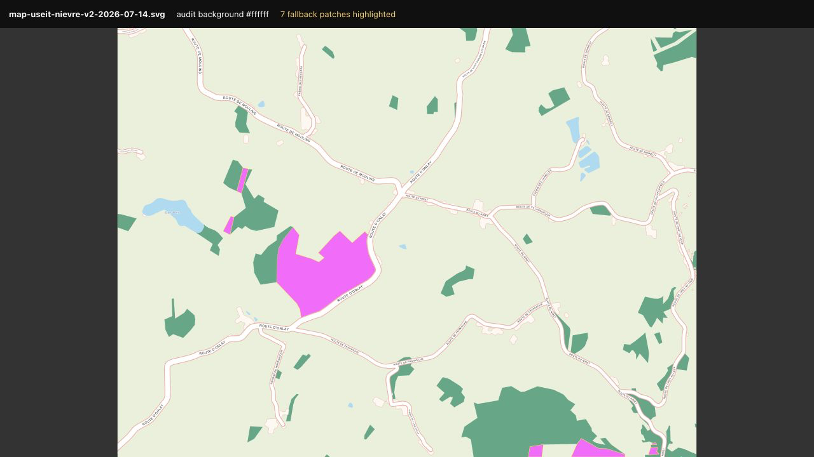

**Middel — twee ongetagde sneden door bos bij Étang Boiré.** Ook dit zijn inner ways zonder eigen tags in dezelfde meadowrelation, geen geometriefout van de exporter.

**Middel — één scrubvlak heeft dezelfde classifierfout als Ghent.** Het hoort als veld-/landcovertint te renderen, niet als crème fallback.

**Fallbacktotaal:** 7 vlakken = 1 Scrub + 6 Uncategorized, samen circa 2,48% van het kader. Straatlabels volgen de wegen goed; herhaling van Route d'Onlay/Route du Niret is bij zulke lange landelijke trajecten grotendeels functioneel.

**Structuur:** de 60 hamletblobs en 20 losse gebouwen zitten plat in `city_blocks`. Splits ze voor editbaarheid in Hamlets en Standalone buildings. Geen dubbele IDs en geen dekkingsgaten.

[Volledige magentatest](screenshots/nievre-magenta-overview.png) · [detail van het landelijke centrum](screenshots/nievre-rural-core.png) · [OSM-vergelijking](screenshots/nievre-osm-comparison.png)

### Oulu

**Hoog — het centrale spoor vormt een donkere moiréwand.** Iedere parallelle track krijgt casing, sleepers en track. Het roundhouse/rangeerterrein aan de zuidzijde wordt daardoor een vreemd radiaal waaierobject. De geometrie volgt OSM, maar de weergave heeft dringend schaalgeneralisatie nodig.

**Hoog/middel — de begraafplaats in het noordoosten leest als technische hatching.** Honderden gelijkwaardig witte, parallelle paden verdringen de groene gebiedsvorm. Park-/cemeterypaden moeten op deze schaal dunner, lichter of selectiever.

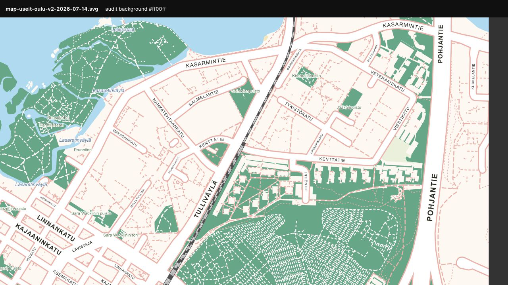

**Hoog — 53 fallbackvlakken:** 28 Uncategorized, 7 Residential, 7 Scrub, 5 Wetland, 3 Parking, 1 Institutional, 1 Dog park en 1 Sports centre. Dog park en sports centre horen bij Parks; scrub/wetland bij Landcover/Countryside; institutional hoort als bebouwd gebiedssignaal mee te wegen. Residentialrestanten vragen controle van overlap- en open-landdrempels.

**Middel — labelduplicatie.** Lasaretinväylä staat driemaal dicht bij elkaar en gebruikt driemaal exact `feat_Lasaretinv_yl_`; Vaaranpuisto heeft hetzelfde probleem. Joutsentie verschijnt driemaal over een relatief korte kaartafstand.

[Volledige magentatest](screenshots/oulu-magenta-overview.png) · [fallbackoverzicht](screenshots/oulu-fallback-overview.png) · [OSM-vergelijking](screenshots/oulu-osm-comparison.png)

### Paris

**Kritiek — ondergrondse metro leest als bovengrondse kaartinhoud.** Dikke gekleurde lijnen lopen over straten, parken, spoor en Seine. Ook verbindingen als werkplaats-/lijnraccordementen komen mee. De engine laat metro-tunnels bewust door voor een schematische overlay; voor een publicatiekaart moet deze laag standaard uit, veel subtieler, of beperkt worden tot relevante stations-/route-informatie.

**Hoog — metrolijnwerk wordt deels dubbel opgebouwd.** `metro_metro_default` bevat losse member ways naast benoemde routerelaties, wat dubbele lijnen, ronde eindkappen en gekleurde blobs geeft. De metro-UID-generator start bovendien per lijngroep opnieuw, waardoor onder andere `M_tro_5`-IDs botsen.

**Hoog — Gare de Lyon/Bercy en het zuidoostelijke emplacement worden bijna zwarte spoorwaaiers.** De huidige drielaagse spoorstijl werkt voor een paar tracks, maar niet voor een groot emplacement.

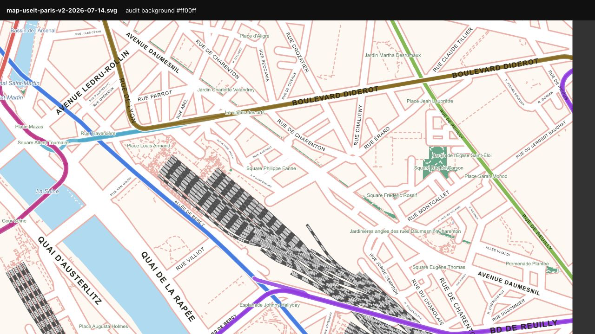

**Hoog/middel — veel daadwerkelijke labelbotsingen en duplicaten.** Voorbeelden zijn Périphérique/Quai d'Ivry, Avenue Ledru-Rollin/Rue d'Austerlitz en meerdere Rue de Tolbiac-labels. Canal Saint-Martin, Jardin de la Raffinerie Say, Jardin de la Dalle d'Ivry en Marché Jeanne d'Arc staan tweemaal met hetzelfde ID. Place Ginette Hamelin verschijnt als groen featurelabel én zwart straat-/plaatslabel.

**Middel — technische OSM-namen komen zonder redactionele filtering in beeld.** `Place FO/13` is een voorbeeld dat op een publiekskaart administratief/technisch leest. Voeg een naamkwaliteits- of editorreviewstap toe in plaats van zulke tags blind te publiceren.

**Positief:** Paris heeft nul fallbackvlakken en nul dekkingsgaten.

[Volledige magentatest](screenshots/paris-magenta-overview.png) · [OSM-vergelijking](screenshots/paris-osm-comparison.png) · [metro-/labeldetail](screenshots/paris-labels-metro.png)

### Tilburg

**Laag/middel — visueel de schoonste export.** De kaart komt nagenoeg overeen met de bestaande Illustrator-referentie. De spoorbaan is stevig, maar bij vier parallelle tracks nog geloofwaardiger dan in Oulu/Paris. Centrum- en parklabels zijn overwegend goed uitgelijnd.

**Middel — 21 fallbackvlakken:** 14 Uncategorized, 3 Greenery, 2 Parking, 1 Railway en 1 Scrub. Greenery/scrub horen bij groen/landcover; parking en railway vragen een expliciete verharde/railgrondcategorie. Een groot, zeer dun Uncategorized-vlak lijkt een road-mask/complementnaad en geen zelfstandig cartografisch object.

**Laag/middel — groen vlak bij Tivolistraat is semantisch onduidelijk.** Losse waterslierten en het ontbreken van een gebiedslabel maken het alsof het object is afgesneden of verkeerd gecategoriseerd. Controleer de bronfeature en geef het óf een herkenbare naam/categorie óf reduceer het detail.

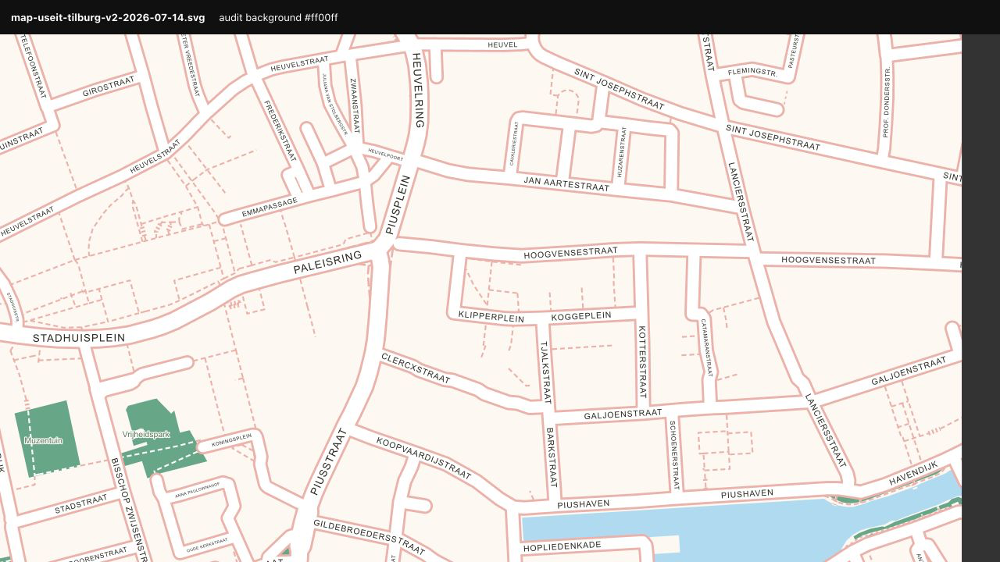

**Positief:** geen dubbele IDs, geen dekkingsgaten en geen duidelijke regressie ten opzichte van de Illustrator-referentie.

[Volledige magentatest](screenshots/tilburg-magenta-overview.png) · [fallbackoverzicht](screenshots/tilburg-fallback-overview.png) · [OSM-vergelijking](screenshots/tilburg-osm-comparison.png) · [Illustrator-referentie](../../exports/map-useit-tilburg-2026-07-06-152733-illustrator-reference.png)

## Vergelijking met de USE-IT Ghent-reference uit 2021

De PDF is geen één-op-één stijlcontract voor de huidige OSM-export: hij bevat redactionele illustraties, POI's, routes, iconen en handmatige ingrepen die niet uit OSM volgen. Wel zijn drie principes relevant:

1. **Rustiger naambeeld:** water- en parknamen worden minder vaak herhaald.
2. **Duidelijkere hiërarchie:** routehighlight, landmarks en hoofdstraten sturen het oog; technische details blijven ondergeschikt.
3. **Groen leest als gebied, niet als padennet:** interne parkpaden zijn solider en rustiger dan de huidige dichte witte stippelrasters.

De huidige basiskleuren cream/roze/blauw/groen passen goed bij de reference. De grootste winst zit niet in een nieuwe kleurtaal, maar in generalisatie, deduplicatie en betere semantische lagen.

## Aanbevolen uitvoeringsvolgorde

De uitvoerbare, hervatbare opvolging staat in
[`plans/2026-07-17_cartographic-audit-followup.md`](../../plans/2026-07-17_cartographic-audit-followup.md).
Dat plan bevat unitgrenzen, acceptatiecriteria, rate-limitregels en de actuele
statusoverdracht via `plans/ACTIVE.md`.

1. **Documentbrede ID-uniciteit** repareren en met een XML-test borgen.
2. **Paris metrobeleid** aanpassen: tunnels/serviceverbindingen filteren of metro standaard niet als oppervlaktemap tonen.
3. **Zichtbare place-labels** voor Nièvre/landelijke kaders toevoegen.
4. **Featurelabelpipeline** herschrijven naar dedup per naam + verbonden/geografische cluster; pleinen uit de parkhack halen.
5. **Railgeneralisatie** invoeren voor grote yards en roundhouses.
6. **Bekende fallbacktags binden:** scrub, wetland, golf, allotments, dog park, sports centre; daarna residential/institutional/parkingdrempels controleren.
7. **Detailniveau van park-/cemeterypaden** terugbrengen en gebouwenweefsel op printschaal beoordelen.
8. Daarna opnieuw dezelfde zeven exports draaien en deze audit als regressieset gebruiken.

## Bewijsbestanden

- Alle overzichts-, fallback-, detail- en OSM-vergelijkingsbeelden: [`screenshots/`](screenshots/)
- Interactieve lokale auditviewer: [`viewer.html`](viewer.html)
- Omgezette Ghent-reference: [`references/2021_ghent/`](../../references/2021_ghent/)
